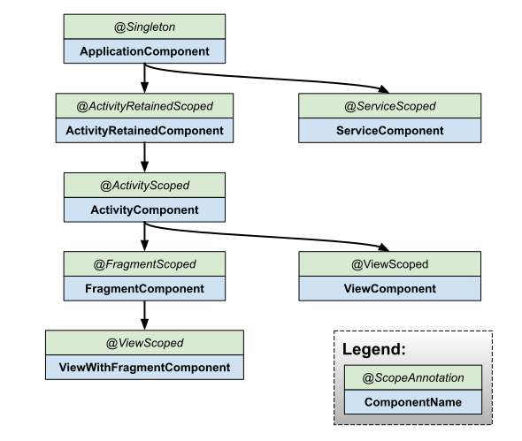
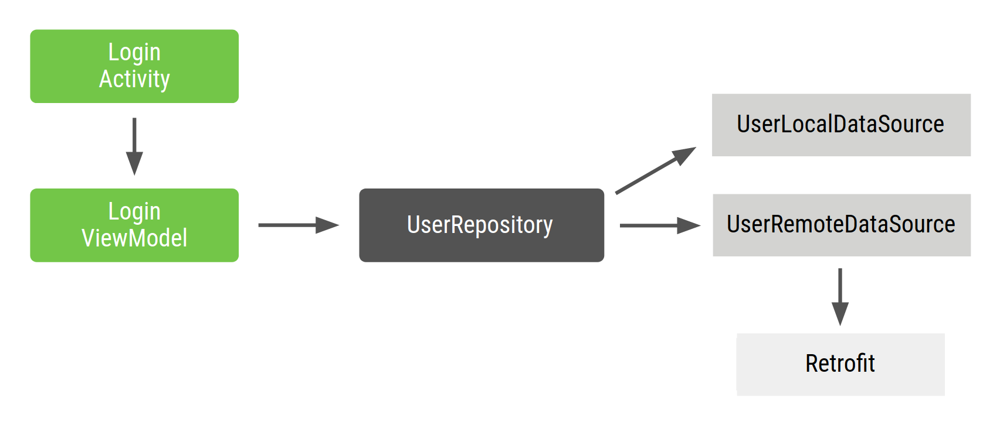

#  Hilt

- Dagger를 기반으로 빌드된 안드로이드용 DI 프레임워크
- 프로젝트의 모든 안드로이드 클래스에 컨테이너를 제공하고 수명주기를 자동으로 관리한다


## Adding dependencies

### Project build.gradle

```groovy
buildscript {
    ...
    dependencies {
        ...
        classpath 'com.google.dagger:hilt-android-gradle-plugin:2.28-alpha'
    }
}
```

### App build.gradle

```groovy
apply plugin: 'kotlin-kapt'
apply plugin: 'dagger.hilt.android.plugin'

android {
    compileOptions {
    sourceCompatibility JavaVersion.VERSION_1_8
    targetCompatibility JavaVersion.VERSION_1_8
  }
}

dependencies {
    implementation "com.google.dagger:hilt-android:2.28-alpha"
    kapt "com.google.dagger:hilt-android-compiler:2.28-alpha"
}
```


## Hilt Application Class

- Hilt를 사용하는 모든 앱은 `@HiltAndroidApp`으로 주석이 지정된 Application 클래스를 포함해야 한다
- `@HiltAndroidApp`은 애플리케이션 수준 dependency 컨테이너 역할과 Hilt의 코드 생성을 트리거한다

### Dagger

```kotlin
@Component
interface ApplicationCompenent { ... }

class ExampleAppication : Application() {
  val appComponent: ApplicationComponent = DaggerApplicationComponent.create()
  ...
}
```

### Hilt

```kotlin
@HiltAndroidApp
class ExampleApplication : Application() { ... }
```


## Hilt Android classes

- `@AndroidEntryPoint` 주석을 지정함으로 다른 Android 클래스에 dependency를 제공할 수 있다
- 지원하는 안드로이드 클래스
  - Application(@HiltAndroidApp)
  - Activity
  - Fragment
  - View
  - Service
  - BroadcastReceiver

### Dagger

```kotlin
@Subcomponent
interface ActivityComponent { 
  @Subcomponent.Factory
  interface Factory {
    fun create(): ActivityComponent
  }
  
  fun inject(activity: ExampleActivity)
  ...
}

@Module(subcomponents = [ActivityComponent::class])
class AppSubcomponents {}

@Component(modules = [AppSubcomponents::class])
interface ApplicationComponent {
  @Component.Factory
  interface Factory {
    fun create(): ApplicationComponent
  }
  
  fun activityComponent(): ActivityComponent.Factory
  ...
}

class ExampleActivity: AppCompatActivity() {
  @Inject lateinit var analytics: AnalyticsAdapter
  val activityComponent: ActivityComponent = appComponent.activityComponent().create()
  
  override onCreate(savedInstanceState: Bundle?) {
    activityComponent.inject(this) // super.onCreate()를 호출하기 전에 Dagger를 주입해야 한다
    
    super.onCreate(savedInstanceState)
    setContentView(R.layout.activity_example)
  }
}
```

### Hilt

```kotlin
@AndroidEntryPoint
class ExampleActivity: AppCompatActivity() { 
  @Inject lateinit var analytics: AnalyticsAdapter
}
```


## Hilt bindings

- Dependency Injection을 실행하려면 Hilt가 해당 컴포넌트에서 필요한 dependency의 인스턴스를 제공하는 방법을 알아야 한다

### 생성자 주입

- 클래스의 생성자에 `@Inject` 주석을 사용하여 클래스의 인스턴스를 제공하는 방법을 Hilt에 알려준다

```kotlin
class AnalyticsAdapter @Inject constructor(
  private val service: AnalyticsService
) { ... }
```

### 모듈 주입

- 생성자 주입을 할 수 없는 상황(인터페이스, 외부 라이브러리의 클래스)에 사용한다
- Dagger와 같이 `@Module` 주석을 지정한다
- 하지만, Dagger와 달리 `@InstallIn` 주석을 지정하여 모듈을 사용할 Android 클래스를 Hilt에 알려야 한다

### Dagger

```kotlin
@Module
abstract class AnalyticsModule { ... }

@Subcomponent(modules = [AnalyticsModule::class])
interface ActivityComponent { ... }
```

### Hilt

```kotlin
@InstallIn(ActivityComponent::class)
@Module
abstract class AnalyticsModule { ... }
```


#### @Binds

- 인터페이스의 인스턴스를 제공해야 할 때 사용한다
- 함수 반환 타입은 함수가 어떤 인터페이스의 인스턴스를 제공하는지 Hilt에 알려준다
- 함수 파라미터는 어떤 구현 클래스를 제공하는지 Hilt에 알려준다

```kotlin
interface AnalyticsService { ... }

class AnalyticsServiceImpl @Inject constructor(
  ...
) : AnalyticsService { ... }

@Module
@InstallIn(ActivityComponent::class)
abstract class AnalyticsModule {
  @Binds
  abstract fun bindAnalyticsService(analyticsServiceImpl: AnalyticsServiceImpl): AnalyticsService
}
```

#### @Provides

- 외부 라이브러리 클래스의 인스턴스를 제공해야 할 때 사용한다
- 함수 반환 타입은 함수가 어떤 타입의 인스턴스를 제공하는지 Hilt에 알려준다
- 함수 파라미터는 함수에 필요한 dependency를 Hilt에 알려준다
- 함수 본문은 해당 타입의 인스턴스를 제공하는 방법을 Hilt에 알려준다

```kotlin
@Module
@InstallIn(ActivityComponent::class)
object AnalyticsModule {

  @Provides
  fun provideAnalyticsService(
    ...
  ): AnalyticsService {
      return Retrofit.Builder()
               .baseUrl("https://example.com")
               .build()
               .create(AnalyticsService::class.java)
  }
}
```

### 동일한 타입에 대해 여러 바인딩 제공

- 동일한 타입의 다양한 바인딩을 제공하려면 `@Qualifier` 주석으로 한정자를 정의한다
- 한정자는 동일한 타입에 대한 여러 바인딩을 식별하는데 사용된다
- `@Provides`가 지정된 메서드에 한정자로 주석을 지정한다
- 필드 또는 파라미터에 해당 한정자로 주석을 지정하여 필요한 인스턴스를 주입한다

```kotlin
@Qualifier
@Retention(AnnotationRetention.BINARY)
annotation class AuthInterceptorOkHttpClient

@Qualifier
@Retention(AnnotationRetention.BINARY)
annotation class OtherInterceptorOkHttpClient

@Module
@InstallIn(ApplicationComponent::class)
object NetworkModule {

  @AuthInterceptorOkHttpClient
  @Provides
  fun provideAuthInterceptorOkHttpClient(
    authInterceptor: AuthInterceptor
  ): OkHttpClient {
      return OkHttpClient.Builder()
               .addInterceptor(authInterceptor)
               .build()
  }

  @OtherInterceptorOkHttpClient
  @Provides
  fun provideOtherInterceptorOkHttpClient(
    otherInterceptor: OtherInterceptor
  ): OkHttpClient {
      return OkHttpClient.Builder()
               .addInterceptor(otherInterceptor)
               .build()
  }
}

class ExampleServiceImpl @Inject constructor(
  @AuthInterceptorOkHttpClient private val okHttpClient: OkHttpClient
) : ExampleService

@AndroidEntryPoint
class ExampleActivity: AppCompatActivity() {

  @OtherInterceptorOkHttpClient
  @Inject lateinit var okHttpClient: OkHttpClient
}
```

### Hilt 사전 정의된 한정자

- `@ApplicationContext` : Applicaton 컨텍스트 제공
- `@ActivityContext` : Activity 컨텍스트 제공

```kotlin
class AnalyticsAdapter @Inject constructor(
    @ActivityContext private val context: Context,
    private val service: AnalyticsService
) { ... }
```


## Hilt Component

| Hilt 컴포넌트             | 주입 대상                                |
| ------------------------- | ---------------------------------------- |
| ApplicationComponent      | Application                              |
| ActivityRetainedComponent | ViewModel                                |
| ActivityComponent         | Activity                                 |
| FragmentComponent         | Fragment                                 |
| ViewComponent             | View                                     |
| ViewWithFragmentComponent | @WithFragmentBindings 주석이 지정된 View |
| ServiceComponent          | Service                                  |


### Component Lifetime

| Hilt 컴포넌트             | 생성 시기              | 제거 시기               |
| ------------------------- | ---------------------- | ----------------------- |
| ApplicationComponent      | Application#onCreate() | Application#onDestroy() |
| ActivityRetainedComponent | Activity#onCreate()    | Activity#onDestroy()    |
| ActivityComponent         | Activity#onCreate()    | Activity#onDestroy()    |
| FragmentComponent         | Fragment#onCreate()    | Fragment#onDestroy()    |
| ViewComponent             | View#super()           | View destroyed          |
| ViewWithFragmentComponent | View#super()           | View destroyed          |
| ServiceComponent          | Service#onCreate()     | Service#onDestroy()     |


### Component Scope

| Hilt 컴포넌트                            | 생성된 컴포넌트           | 스코프                  |
| ---------------------------------------- | ------------------------- | ----------------------- |
| Application                              | ApplicationComponent      | @Singleton              |
| ViewModel                                | ActivityRetainedComponent | @ActivityRetainedScoped |
| Activity                                 | ActivityComponent         | @ActivityScoped         |
| Fragment                                 | FragmentComponent         | @FragmentScoped         |
| View                                     | ViewComponent             | @ViewScoped             |
| @WithFragmentBindings 주석이 지정된 View | ViewWithFragmentComponent | @ViewScoped             |
| Service                                  | ServiceComponent          | @ServiceScoped          |


### Dagger

```kotlin
@Scope
@MustBeDocumented
@Retention(value = AnnotationRetention.RUNTIME)
annotation class ActivityScoped // @Scope 정의

@ActivityScoped
@Subcomponent
interface ActivityComponent { ... } // 컴포넌트에 @Scope를 지정하면 @Scope가 해당 컴포넌트의 lifetime을 나타낸다
```

### Hilt

```kotlin
@ActivityScoped // Hilt의 사전 정의된 Scope Annotation
```

### @Scope 사용 예시

- `@Scope`가 지정된 바인딩의 인스턴스는 `@Scope`가 지정된 컴포넌트의 lifetime 동안 기존 인스턴스를 유지한다

```kotlin
// 생성자 주입
@ActivityScoped
class AnalyticsAdapter @Inject constructor(
  private val service: AnalyticsService
) { ... }

@Module
abstract class AnalyticsModule {

  // @Binds 주입
  @ActivityScoped
  @Binds
  abstract fun bindAnalyticsService(
    analyticsServiceImpl: AnalyticsServiceImpl
  ): AnalyticsService
}

@Module
object AnalyticsModule {

  // @Provides 주입
  @ActivityScoped
  @Provides
  fun provideAnalyticsService(): AnalyticsService {
      return Retrofit.Builder()
               .baseUrl("https://example.com")
               .build()
               .create(AnalyticsService::class.java)
  }
}
```


### Component hierarchy



### Component Default Bindings

- 바인딩을 정의하지 않아도 기본으로 주입할 수 있는 dependency이다

| Hilt 컴포넌트             | 기본 바인딩                           |
| ------------------------- | ------------------------------------- |
| ApplicationComponent      | Application                           |
| ActivityRetainedComponent | Application                           |
| ActivityComponent         | Application, Activity                 |
| FragmentComponent         | Application, Activity, Fragment       |
| ViewComponent             | Application, Activity, View           |
| ViewWithFragmentComponent | Application, Activity, Fragment, View |
| ServiceComponent          | Application, Service                  |

```kotlin
// Application Component에서 제공
class AnalyticsServiceImpl @Inject constructor(
  application: Application
) : AnalyticsService { ... }

// Activity Component에서 제공
class AnalyticsServiceImpl @Inject constructor(
  activity: Activity
) : AnalyticsService { ... }
```


## Inject dependencies in classes not supported by Hilt

- `@EntryPoint` 주석을 사용하여 진입점을 만들 수 있다
- `@InstallIn`을 추가하여 진입점을 설치할 컴포넌트를 지정한다
- Hilt는 진입점을 통해 컴포넌트에 있는 dependency를 주입한다

```kotlin
class ExampleContentProvider : ContentProvider() {

  @EntryPoint
  @InstallIn(ApplicationComponent::class)
  interface ExampleContentProviderEntryPoint {
    fun analyticsService(): AnalyticsService
  }

  override fun query(...): Cursor {
    val appContext = context?.applicationContext ?: throw IllegalStateException()
    val hiltEntryPoint =
      EntryPointAccessors.fromApplication(appContext, ExampleContentProviderEntryPoint::class.java)

    val analyticsService = hiltEntryPoint.analyticsService()
    ...
  }
  ...
}
```

- 진입점이 ApplicationComponent에 설치되어 있으면 ApplicationContext를 사용하여 진입점을 검색한다
- 진입점이 ActivityComponent에 설치되어 있으면 ActivityContext를 사용하여 진입점을 검색한다


## Hilt ViewModel

### App build.gradle

```groovy
dependencies {
  ...
  implementation "androidx.fragment:fragment-ktx:1.2.4"
  implementation 'androidx.hilt:hilt-lifecycle-viewmodel:$hilt_jetpack_version'
  kapt 'androidx.hilt:hilt-compiler:$hilt_jetpack_version'
  kaptAndroidTest 'androidx.hilt:hilt-compiler:$hilt_jetpack_version'
}
```


### @ViewModelInject Annotation

```kotlin
class RegistrationViewModel @ViewModelInject constructor(
    val userManager: UserManager
) : ViewModel() { ... }
```


### ViewModel Delegate Function

```kotlin
class RegistrationActivity : Activity() {
//    @Inject lateinit var registrationViewModel: RegistrationViewModel
    private val registrationViewModel: RegistrationViewModel by viewModels()
}
```

```kotlin
class RegistrationFragment : Activity() {
//    @Inject lateinit var registrationViewModel: RegistrationViewModel
    private val registrationViewModel: RegistrationViewModel by activityViewModels()
}
```


## Hilt Dependency Injection

### Application Graph



### @Inject Annotation

```kotlin
// UserRepository
class UserRepository @Inject constructor(
    private val localDataSource: DataSource,
    private val remoteDataSource: DataSource
) { ... }

// UserLocalDataSource
class UserLocalDataSource @Inject constructor(
    private val context: Context
) : DataSource { ... }

// UserRemoteDataSource
class UserRemoteDataSource @Inject constructor(
    private val loginService: LoginRetrofitService
) : DataSource { ... }

// LoginViewModel
class LoginViewModel @Inject constructor(
    private val userRepository: UserRepository
) { ... }

// LoginActivity
class LoginActivity: Activity() {
    @Inject lateinit var loginViewModel: LoginViewModel
    ...
}

// LoginViewModel
class LoginViewModel(
    @Inject private val userRepository: UserRepository
) { ... }
```


### @Module Annotation

```kotlin
@Module
@InstallIn(ApplicationComponent::class)
abstract class DataModule {
    @Provides
    fun retrofit(): Retrofit {
        return Retrofit.Builder()
            .baseUrl("https://example.com")
            .build()
            .create(LoginService::class.java)
    }
  
    @Binds
    abstract fun userLocalDataSoruce(dataSource: UserLocalDataSource): DataSource
  
    @Binds
    abstract fun userRemoteDataSoruce(dataSource: UserRemoteDataSource): DataSource
}
```


### Hilt Application Class

```kotlin
@HiltAndroidApp
class MyApplication : Application() { ... }
```


### Hilt Android Classes

```kotlin
@AndroidEntryPoint
class LoginActivity: Activity() {
    @Inject lateinit var loginViewModel: LoginViewModel
    ...
}
```


### Using Scopes

```kotlin
@Singleton
class UserRepository @Inject constructor(
    private val localDataSource: DataSource,
    private val remoteDataSource: DataSource
) { ... }
```

```kotlin
@ActivityScoped
class LoginViewModel @Inject constructor(
    private val userRepository: UserRepository
) { ... }
```


### @ApplicationContext Qualifier

```kotlin
// UserLocalDataSource
class UserLocalDataSource @Inject constructor(
    @ApplicationContext private val context: Context
) : DataSource { ... }
```


### @Qualifier Annotation

```kotlin
@Retention(AnnotationRetention.BINARY)
@Qualifier
annotation class UserLocalDataSource

@Retention(AnnotationRetention.BINARY)
@Qualifier
annotation class UserRemoteDataSource
```

```kotlin
@Module
@InstallIn(ApplicationComponent::class)
abstract class DataModule {  
    ...
  
    @UserLocalDataSource
    @Binds
    abstract fun userLocalDataSoruce(dataSource: UserLocalDataSource): DataSource
  
    @UserRemoteDataSource
    @Binds
    abstract fun userRemoteDataSoruce(dataSource: UserRemoteDataSource): DataSource
}
```

```kotlin
@Singleton
class UserRepository @Inject constructor(
    @UserLocalDataSource private val localDataSource: DataSource,
    @UserRemoteDataSource private val remoteDataSource: DataSource
) { ... }
```

