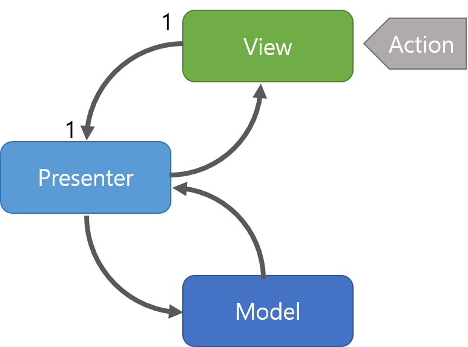

# 디자인 패턴

## MVC

### 구조

 - Model : 어플리케이션에서 사용되는 데이터와 그 데이터를 처리하는 부분
 - View : 사용자에게 보여지는 UI 부분
 - Controller : 사용자의 입력(Action)을 받고 처리하는 부분

### 동작
 1. 사용자의 Action들은 Controller에 들어오게 된다
 2. Controller는 사용자의 Action를 확인하고, Model을 업데이트한다
 3. Controller는 Model을 나타내줄 View를 선택한다
 4. View는 Model을 이용하여 화면을 나타낸다

### 특징
 - Controller는 여러개의 View를 선택할 수 있는 1:n 구조
 - Controller는 View를 선택할 뿐 직접 업데이트 하지 않는다 (View는 Controller를 알지 못한다)

### 장점
 - MVC 패턴의 장점은 널리 사용되고 있는 패턴이라는 점에 걸맞게 가장 단순하다

### 단점
 - View와 Model 사이의 의존성이 높다
 - View와 Model의 높은 의존성은 어플리케이션이 커질 수록 복잡하지고 유지보수가 어렵게 만든다

## MVP

### 구조

 - Model : 어플리케이션에서 사용되는 데이터와 그 데이터를 처리하는 부분
 - View : 사용자에게 보여지는 UI 부분
 - Presenter : View에서 요청한 정보로 Model을 가공하여 View에 전달해 주는 부분

### 동작
 1. 사용자의 Action들은 View를 통해 들어오게 된다
 2. View는 데이터를 Presenter에 요청한다
 3. Presenter는 Model에게 데이터를 요청한다
 4. Model은 Presenter에서 요청받은 데이터를 응답한다
 5. Presenter는 View에게 데이터를 응답한다
 6. View는 Presenter가 응답한 데이터를 이용하여 화면을 나타낸다

### 특징
 - Presenter는 View와 Model의 인스턴스를 가지고 있어 둘을 연결하는 역할을 한다
 - Presenter와 View는 1:1 관계이다

### 장점
 - View와 Model의 의존성이 없다
 - MVC 패턴의 단점이었던 View와 Model의 의존성을 해결하였다(Presenter를 통해서만 데이터를 전달 받기 때문에)

### 단점
 - View와 Presenter 사이의 의존성이 높다

## MVVM

### 구조

 - Model : 어플리케이션에서 사용되는 데이터와 그 데이터를 처리하는 부분
 - View : 사용자에게 보여지는 UI 부분
 - ViewModel : View를 표현하기 위한 Model이자 View를 나타내기 위한 데이터 처리를 하는 부분

### 동작
 1. 사용자의 Action들은 View를 통해 들어오게 된다
 2. View에 Action이 들어오면, Command 패턴으로 ViewModel에 Action을 전달한다
 3. ViewModel은 Model에게 데이터를 요청한다
 4. Model은 ViewModel에게 요청받은 데이터를 응답한다
 5. ViewModel은 응답 받은 데이터를 가공하여 저장한다
 6. View는 ViewModel과 Data Binding하여 화면을 나타낸다

### 특징
 - MVVM 패턴은 Command 패턴과 Data Binding 두 가지 패턴을 사용하여 구현되었다
 - View와 ViewModel 사이의 의존성을 없앴다
 - ViewModel과 View는 1:n 관계이다

### 장점
 - View와 Model 사이의 의존성이 없다
 - View와 View Model 사이의 의존성이 없다
 - 각각의 부분이 독립적이기 때문에 모듈화할 수 있다

### 단점
 - View Model의 설계가 쉽지 않다
