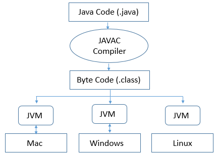
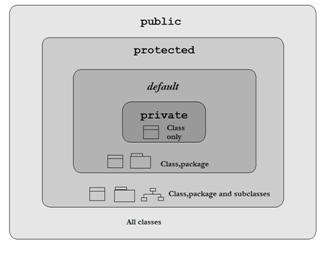

# 자바

## 자바의 특징
 1. 운영체제에 독립적이다
    - 자바 응용 프로그램은 JVM하고만 통신하며, 명령을 JVM이 해당 운영체제가 이해할 수 있도록 변환한다

 2. 객체지향언어이다
    - 객체지향개념의 특징(캡슐화, 추상화, 상속, 다형성)이 잘 적용되어있다

 3. 비교적 배우기 쉽다
    - C++과 스몰톡의 장점은 취하면서 복잡하고 불필요한 부분을 제거하여 단순화하였다

 4. 자동 메모리 관리(Garbage Collection)
    - 가비지컬렉터가 프로그래머가 사용하지 않는 메모리를 체크하고 반환한다

 5. 네트워크와 분산처리를 지원한다
    - 다양한 네트워크 프로그래밍 라이브러리를 제공한다

 6. 멀티쓰레드를 지원한다
    - 시스템과 관계없이 멀티쓰레드를 구현할 수 있으며, 관련된 라이브러리를 제공한다

 7. 동적 로딩을 지원한다
    - 실행 시에 모든 클래스가 로딩되지 않고 필요한 시점에(동적) 클래스를 로딩하여 사용한다

## JVM(Java Virtual Machine)

 - 자바를 실행하기 위한 가상 기계(컴퓨터)
 - 자바 어플리케이션은 JVM에서만 실행된다
 - 자바 컴파일러가 자바 파일을 클래스 파일(바이트코드)로 변환하고 JVM이 해당 운영체제에 맞는 기계어로 변환한다
 - JVM은 인터프리터 방식을 사용하기 때문에 속도가 느리다는 단점이 있지만,
 바이트코드를 기계어로 바로 변환해주는 JIT 컴파일러와 향상된 최적화 기술로 속도의 격차를 많이 줄였다.

## JDK(Java Development Kit)
 - 자바 개발도구
 - JRE + 개발에 필요한 실행파일
    - javac.exe : 자바 컴파일러, 자바소스코드를 바이트코드롤 컴파일한다
    - java.exe : 자바 인터프리터, 컴파일러가 생성한 바이트코드를 해석하고 실행한다
    - jar.exe :  압축 프로그램, 클래스 파일과 프로그램의 실행에 관련된 파일을 하나의 jar파일로 압축하거나 압축해제한다

### JRE(Java Runtime Environment)
 - 자바실행환경
 - 자바 응용 프로그램이 실행되기 위한 최소 환경
 - JVM + 클래스 라이브러리(Java API)

## 변수(Variable)
 - 단 하나의 값을 저장할 수 있는 메모리 공간

### 변수의 타입
 1. 기본형
    - 실제 값(data)을 저장한다
    - 논리형(boolean), 문자형(char), 정수형(byte, short, int, long), 실수형(float, double)
        - boolean : 1 byte (true, false)
        - char : 2 byte (unicode)
        - byte : 1 byte
        - short : 2 byte
        - int : 4 byte
        - long : 8 byte
        - float : 4 byte
        - double : 8 byte

 2. 참조형
    - 어떤 값이 저장되어 있는 주소(memory address)를 저장한다
    - 객체의 주소, 8개의 기본형을 제외한 나머지 타입

### 문자 인코딩 & 디코딩
 - 인코딩 : 문자를 코드로 변환하는 것('A' -> 65)
 - 디코딩 : 코드를 문자로 변환하는 것(65 -> 'A')

#### 아스키코드(Ascii Code)
 - 정보교환을 위한 미국 표준 코드
 - 128개의 문자 집합을 제공하는 7 bit 부호

#### 유니코드(Unicode)
 - 전 세계의 모든 문자를 하나의 통일된 문자 집합으로 표현한 코드표
 - 2 byte로 65536개의 문자를 표현할 수 있다
 - UTF : 유니코드를 컴퓨터에 저장하는 방식(인코딩)
    - UTF-8 : 하나의 문자를 1 ~ 4 byte의 가변크기로 표현한다(영어, 숫자 : 1 byte, 한글 : 3 byte)
    - UTF-16 : 모든 문자를 2 byte의 고정크기로 표현한다(자바는 UTF-16을 사용)

## 객체지향 프로그래밍(Object-Oriented Programming)
 - 실제 세계를 모델링하여 기능(메소드)과 속성(멤버변수)을 가진 객체를 만들고, 객체들간의 상호작용을 통해 로직을 구성하는 프로그래밍 방법

### 장점
 1. 코드의 재사용성이 높다
    - 기존의 클래스를 가져오거나(import) 상속을 통해 확장하여 사용할 수 있다

 2. 유지보수가 용이하다
    - 코드 수정이나 추가 시 해당되는 클래스의 멤버변수, 메소드만 수정하면 된다

 3. 대형 프로젝트에 적합하다
    - 클래스 단위로 캡슐화(모듈화)가 가능하기에 여러 명이 개발 업무를 분담하기 쉽다

### 단점
 1. 실행속도가 상대적으로 느리다(vs 절차지향)
 2. 설계시 많은 시간과 노력이 필요하다
 3. 객체가 많으면 메모리 소모가 커질 수 있다

### 클래스와 인스턴스
 - 클래스 : 객체를 정의한 것(객체의 설계도)
 - 인스턴스 : 클래스의 정의된 내용대로 메모리에 할당된 것(객체의 실체화)

### 추상화
 - 객체의 공통적인 속성과 기능을 추출하여 정의한다

### 캡슐화
 - 기능과 속성을 하나의 캡슐(클래스)로 만든다
 - 접근제어자를 사용하여 외부로부터 데이터와 구조를 숨긴다  

### 상속
 - 기존의 클래스를 재사용하여(상속) 새로운 클래스로 확장한다
 - 부모클래스의 속성과 기능을 그대로 사용할 수 있고, 기능의 수정이 필요한 경우 해당 기능을 재정의(overriding)한다

### 다형성
 - 하나의 기능이나 객체가 다른 여러 기능이나 객체로 사용될 수 있다
 - overriding : 상속 받은 메소드나 멤버변수를 재정의하는 것(인터페이스의 메소드를 구현하는 것)
 - overloading : 메소드의 이름이 같지만 파라미터의 타입과 개수가 다른 메소드를 여러 개 정의하는 것
